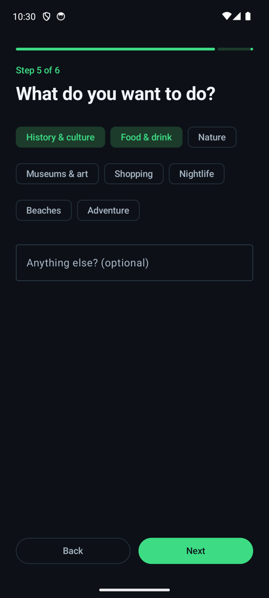
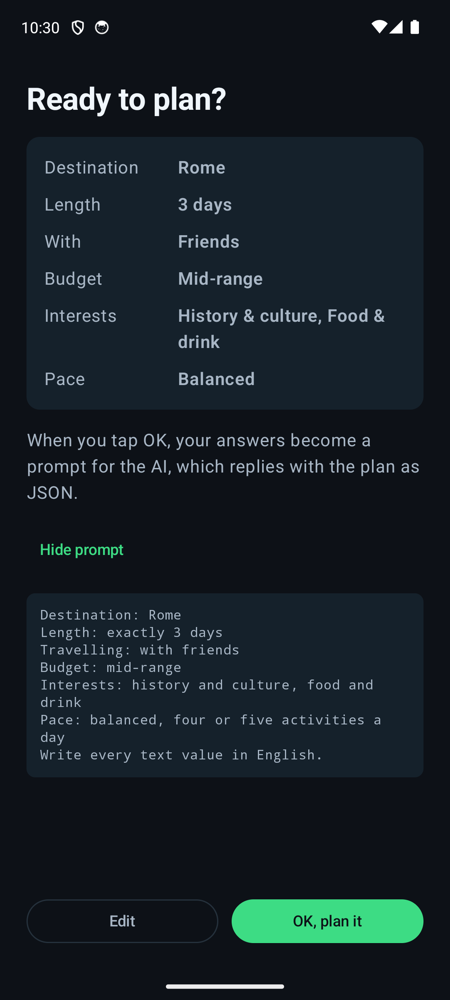
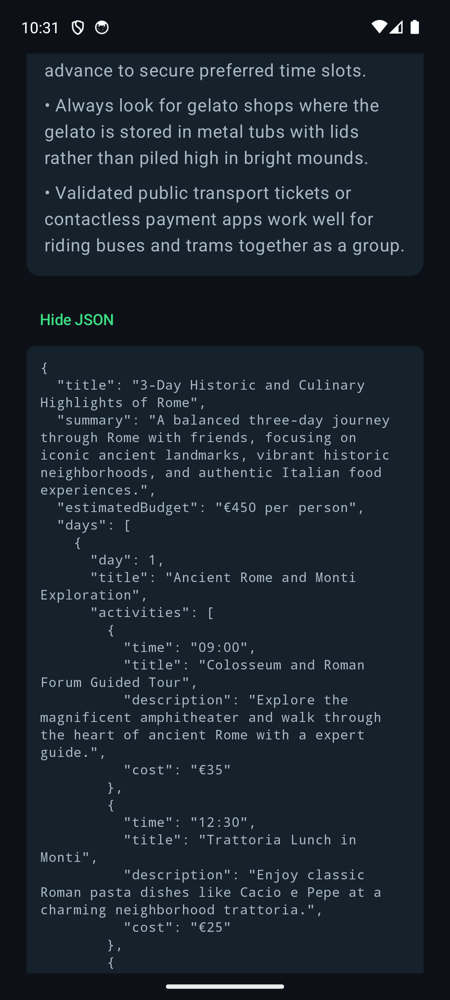

# Seyahatname

[](https://github.com/ogzhngms/seyahatname-android/actions/workflows/ci.yml)

An Android trip planner built with Jetpack Compose and Gemini. The app asks six short questions, one at a time: where you are going, for how long, who you are travelling with, your budget, what you want to do and the pace you like. When you confirm, it turns the answers into a prompt, asks Gemini for the plan as JSON that follows a fixed schema, and renders that JSON as a day-by-day itinerary.

The name comes from Evliya Çelebi's *Seyahatname*, the 17th-century Ottoman book of travels.

| Questions | Confirm (with the prompt) | Plan | Raw JSON |
|---|---|---|---|
|  |  |  |  |

## How it works

```
answers ─► buildPrompt() ─► Gemini (JSON schema output) ─► JSON ─► parseItinerary() ─► Compose screens
```

- **Prompt:** `Trip.kt` turns the answers into a short English prompt and asks for the reply in the phone's language.
- **Gemini call:** `GeminiPlanner.kt` posts to the Gemini REST API (`generateContent`) with `responseMimeType: application/json` and `responseJsonSchema: ITINERARY_SCHEMA`, so the reply is JSON with exactly the fields the app reads.
- **Free models, in the background:** the app works through eight free-tier models in order: Gemini 3.8, 3.7, 3.6 and 3.5 Flash, Gemini 3.5 and 3.1 Flash-Lite, and Gemma 4 31B and 26B. If one is retired (404), out of free quota (429), overloaded (5xx) or does not answer within 60 seconds, the request quietly moves to the next. Users never pick or see a model. With no network, it stops at once instead of trying every model.
- **Parsing and UI:** `Itinerary.kt` parses the JSON with `org.json`. `TripViewModel` moves through the question, confirm, loading, result and error screens.
- **Demo mode:** without an API key, the app plays back a bundled sample plan (`res/raw`, English and Turkish), so the whole flow works offline.
- **Firebase:** the app is registered in a Firebase project (`app/google-services.json`), ready for Crashlytics or for moving the Gemini call to Firebase AI Logic.

The interface is in English and Turkish and follows the device language.

## Run it

1. Open the project in Android Studio.
2. Create a Gemini API key in [Google AI Studio](https://aistudio.google.com/apikey) and add it to `local.properties` (this file is git-ignored):
   ```properties
   GEMINI_API_KEY=...
   ```
3. Run the `app` configuration. Without a key, the app starts in demo mode.

> **Note:** the key is compiled into the APK through `BuildConfig`. That is fine for local testing, but anyone who has the APK can extract the key. Before publishing, move the call to Firebase AI Logic (no key in the app, protected by App Check) or behind a small backend.

## Tests

```bash
./gradlew testDebugUnitTest            # JVM: prompt, schema, parser, ViewModel flow, Gemini request contract
./gradlew connectedDebugAndroidTest    # device: Compose UI walk-through of the wizard
```

- `GeminiPlannerTest` runs the planner against a local fake of the Gemini API. It checks the request (key header, schema, system prompt), that thinking parts are skipped, that models which cannot serve or answer too slowly are skipped, that a lost connection stops at once, and the blocked, truncated, bad-key and all-busy paths.
- `ItineraryTest` checks that every schema object is closed and fully required, and that the sample plans match the schema.
- `TripViewModelTest` covers the happy path, a failure followed by a retry, a reply that breaks the schema, and cancelling while the plan is loading.
- `TripFlowTest` taps through all six questions on a device with a stub planner and checks the plan on screen.

CI runs the unit tests and a debug build on every push.

## Stack

Kotlin · Jetpack Compose (Material 3) · ViewModel · Coroutines · Gemini API · Firebase · JUnit · Compose UI Test
