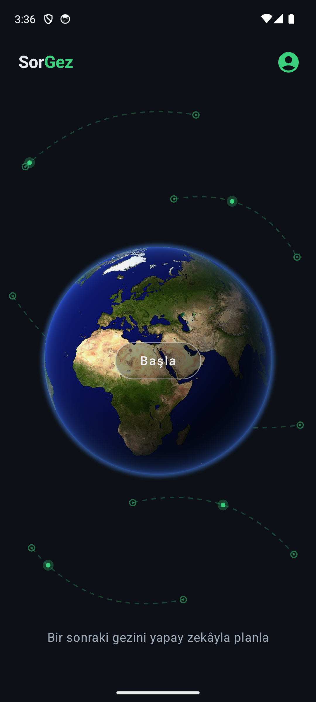
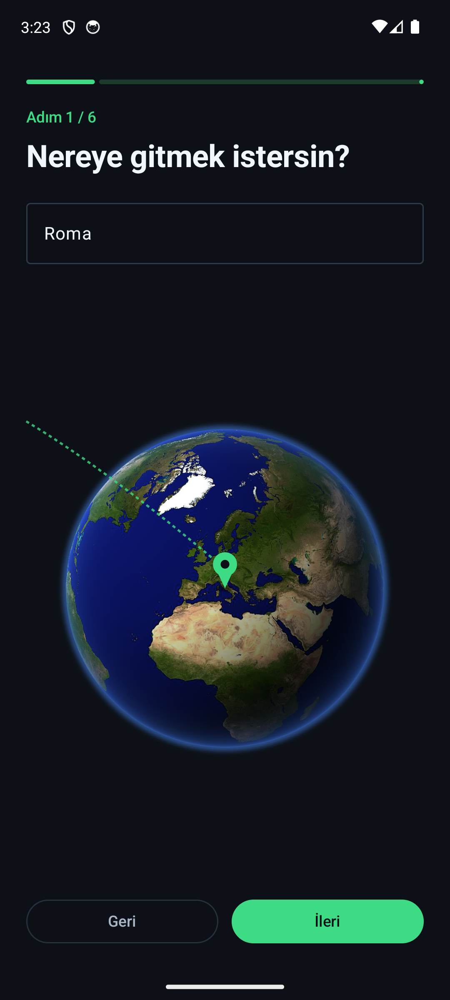
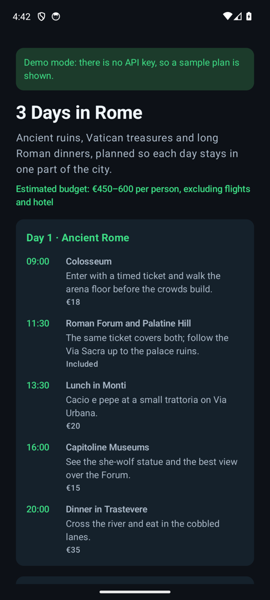
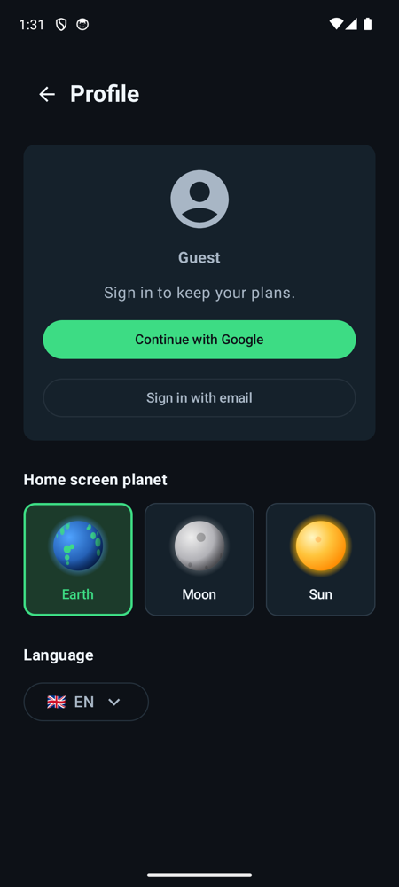

# SorGez

[](https://github.com/ogzhngms/sorgez-android/actions/workflows/ci.yml)

An Android trip planner built with Jetpack Compose and Gemini. It opens on a turning Earth with a Start button at its centre, over dashed flight routes. Start zooms into the Earth and the app asks six short questions, one at a time: where you are going, for how long, who you are travelling with, your budget, what you want to do and the pace you like. When you confirm, it turns the answers into a prompt, asks Gemini for the plan as JSON that follows a fixed schema, and renders that JSON as a day-by-day itinerary.

The name joins two Turkish verbs, *sor* (ask) and *gez* (travel): the app asks, you travel. The logo splits it as Sor|Gez; the store name is Sorgez.

| Home | Questions | Plan | Profile |
|---|---|---|---|
|  |  |  |  |

## How it works

```
answers ─► buildPrompt() ─► Gemini (JSON schema output) ─► JSON ─► parseItinerary() ─► Compose screens
```

- **Prompt:** `Trip.kt` turns the answers into a short English prompt and asks for the reply in the phone's language.
- **Gemini call:** `GeminiPlanner.kt` posts to the Gemini REST API (`generateContent`) with `responseMimeType: application/json` and `responseJsonSchema: ITINERARY_SCHEMA`, so the reply is JSON with exactly the fields the app reads.
- **Free models, in the background:** the app works through eight free-tier models in order: Gemini 3.8, 3.7, 3.6 and 3.5 Flash, Gemini 3.5 and 3.1 Flash-Lite, and Gemma 4 31B and 26B. If one is retired (404), out of free quota (429), overloaded (5xx) or does not answer within 60 seconds, the request quietly moves to the next. Users never pick or see a model. With no network, it stops at once instead of trying every model.
- **Parsing and UI:** `Itinerary.kt` parses the JSON with `org.json`. `TripViewModel` moves through the question, confirm, loading, result and error screens.
- **Demo mode:** without an API key, the app plays back a bundled sample plan (`res/raw`, English and Turkish), so the whole flow works offline.
- **Home, destination and profile:** on Android 13+ the Earth is an AGSL shader (`ui/Earth.kt`) wrapping NASA's Blue Marble imagery (public domain) on a tilted, side-lit sphere with a thin blue rim of air; older phones get a Compose `Canvas` drawing. The first question offers six popular places as cards; once a place is typed or picked, the Earth turns to it and drops a pin. Places are looked up offline in `Places.kt`, 267 cities, regions and countries by their English, Turkish and local names; an unknown place leaves the Earth turning without a pin. The profile screen, opened from the top-right icon, holds a sign-in placeholder, the language, the currency for plan prices (Turkish lira by default) and an about section. The choices are stored on the device (`AppSettings.kt`).
- **Firebase:** each install signs in with an anonymous Firebase account. The language and currency are kept on the device, because the language is needed before the first screen draws, and a copy goes to Cloud Firestore at `users/{uid}`. `firestore.rules` lets a user read and write only their own document and only the known fields and values. When real sign-in arrives, the anonymous account can be linked to Google and keep its uid and settings.

The interface comes in 15 languages: English, Turkish, Spanish, German, French, Italian, Portuguese, Russian, Arabic (right to left), Hindi, Chinese, Japanese, Korean, Indonesian and Azerbaijani. It follows the phone's language until one is picked from the flag menu on the profile screen, and the plan is written in the same language. The confirm screen can show the prompt and the result screen the raw JSON.

## Run it

1. Open the project in Android Studio.
2. Create a Gemini API key in [Google AI Studio](https://aistudio.google.com/apikey) and add it to `local.properties` (this file is git-ignored):
   ```properties
   GEMINI_API_KEY=...
   ```
3. Run the `app` configuration. Without a key, the app starts in demo mode.

> **Note:** the key is compiled into the APK through `BuildConfig`. That is fine for local testing, but anyone who has the APK can extract the key. Before publishing, move the call to Firebase AI Logic (no key in the app, protected by App Check) or behind a small backend.

## Tests

```bash
./gradlew testDebugUnitTest            # JVM: prompt, schema, parser, ViewModel flow, Gemini request contract
./gradlew connectedDebugAndroidTest    # device: Compose UI walk-through of the wizard
```

- `GeminiPlannerTest` runs the planner against a local fake of the Gemini API. It checks the request (key header, schema, system prompt), that thinking parts are skipped, that models which cannot serve or answer too slowly are skipped, that a lost connection stops at once, and the blocked, truncated, bad-key and all-busy paths.
- `ItineraryTest` checks that every schema object is closed and fully required, and that the sample plans match the schema.
- `PlacesTest` checks that place names are found whatever their case, accents or extra words, and that unknown places find nothing.
- `TranslationsTest` checks that every language in the picker has every string, since Android silently falls back to English for a missing one.
- `TripViewModelTest` covers Home and Profile navigation, the happy path, a failure followed by a retry, a reply that breaks the schema, and cancelling while the plan is loading.
- `TripFlowTest` taps Start and all six questions on a device with a stub planner and checks the plan on screen. It also checks that with the keyboard open, Back first closes the keyboard, and that the flag menu picks a language.

CI runs the unit tests and a debug build on every push.

## Stack

Kotlin · Jetpack Compose (Material 3) · ViewModel · Coroutines · Gemini API · Firebase Auth · Cloud Firestore · JUnit · Compose UI Test
